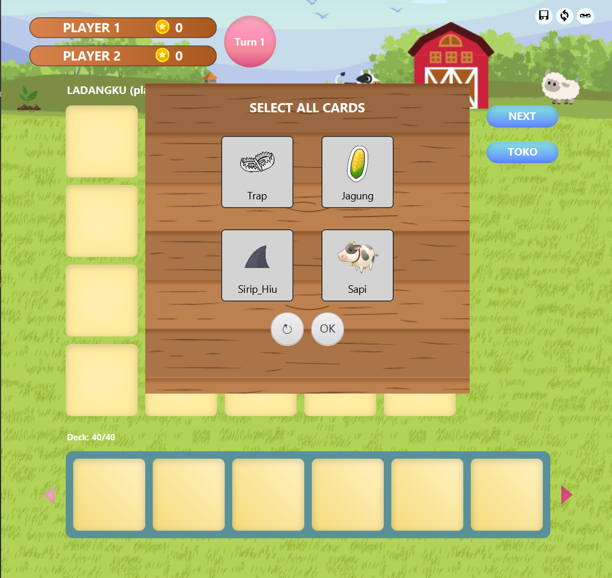
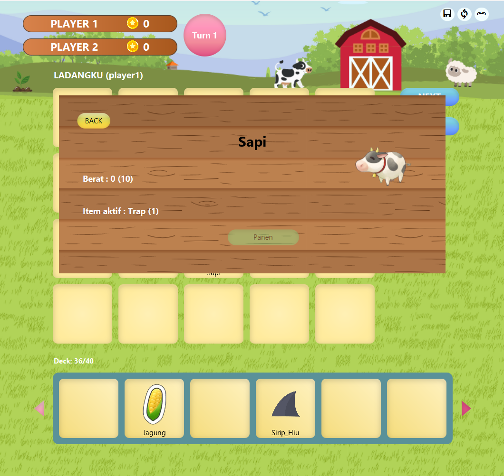
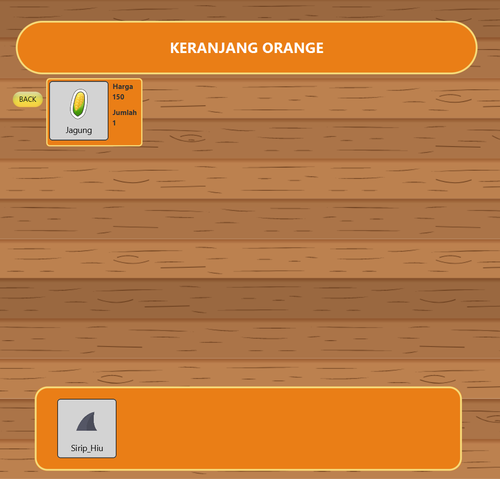

# Remidi Kelola Kerajaan 👑👑
Aplikasi ini merupakan permainan simulasi ladang interaktif di mana pemain dapat menanam tanaman dan memelihara hewan di petak ladang berukuran 4 x 5. Pemain dapat men drag and drop kartu dari deck aktif ke ladang untuk menanam atau memelihara. Setiap petak dapat diberi item khusus yang memberikan efek pada tanaman atau hewan yang ada di sana. 


# Cara compile sekaligus run
1. Melakukan command ```mvn clean package``` pada terminal  
2. Lalu navigasi menuju folder target dengan ```cd target```
3. Lalu jalankan program dengan memasukkan command ```java --module-path "C:\Program Files\JetBrains\javafx-sdk-22.0.1\lib" --add-modules javafx.controls,javafx.fxml -jar IF2210_TB2_IQ9-1.0-SNAPSHOT.jar```
4. NOTE PENTING : Diharuskan untuk mendownload javafx dan memasukkannya pada folder JetBrains

# Versi Java yang dipakai
Java 22


# Screenshot aplikasi
## Tampilan Menu Shuffle Kartu


## Tampilan dalam permainan




## Tampilan Toko Pada Game


## Tampilan Menang Permainan


# Identitas Pembuat
|   NIM    |          Name          |
|:--------:|:----------------------:|
| 13522135 | Christian Justin Hendrawan  |  
| 13522139 |   Attara Majesta Ayub   |
| 13522142 | Farhan Raditya Aji |
| 13522146 |   M. Zaidan Sa’dun R.   |
| 13522159 |  Rafif Ardhinto I.  |